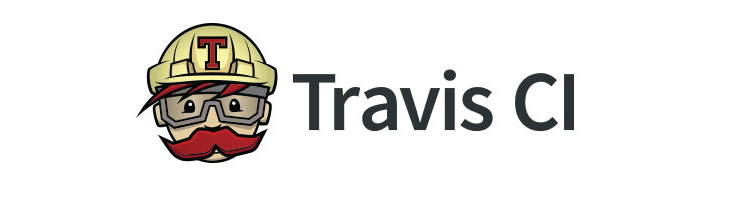

Siguiendo con el tema de modernizar los builds, esta vez le tocó el turno al [Zombies 2012](http://torresbaldi.com/juegos/zombies-2012/). Voy a dar un repaso del nuevo proceso de build multiplataforma (por el momento: windows, linux, wiz, caanoo) del juego.

Este post podría considerarse continuación de la [integración continua en BennuGD](http://torresbaldi.com/integracion-continua-en-bennugd/)

<!-- more -->

Lo primero que hice fue automatizar la construcción de los _FPGs_, a partir de carpetas con PNGs. Este proceso antes ya se estaba haciendo, pero por fuera del repositorio, y se subían los archivos resultantes.

Ahora se subieron los archivos de imágenes originales al repo, y el proceso de construcción de fpgs ya forma parte del build del juego.

### Build de archivos FPG

Para esto estoy usando _fpgtool_, una herramienta también programada en BennuGD, y también [publicada en GitHub](https://github.com/TorresBaldi/bgd-fpgtool).

La herramienta **fpgtool** se utiliza por consola, pero dado que puede trabajar tanto en 16 como en 32 _bits de profundidad de color_, y para ello necesita abrir una ventana gráfica, tuve que usar [un pequeño truco de Travis](https://docs.travis-ci.com/user/gui-and-headless-browsers/#Using-xvfb-to-Run-Tests-That-Require-a-GUI) para que pueda funcionar en modo _headless_, es decir sin necesidad de monitor.

### Builds de distintas plataformas

El siguiente paso fue automatizar los builds de las distintas plataformas. Anteriormente ya tenía un conjunto de _batch files_ para realizar la compilación y empaquetado en windows, pero decidí comenzar de 0 con un nuevo y único script en _Bash_.

El script en cuestión está compuesto de varias funciones parametrizadas que se encargan de armar los paquetes para cada una de las plataformas.

Los **archivos especiales de cada plataforma**, como scripts de lanzamiento, iconos, etc., también forman parte del repositorio, en una carpeta especial para este tipo de archivos.

Para los **binarios de BennuGD** la mejor solución que encontré por el momento es tenerlos en un repositorio separado, el cual agrego al juego como un _submódulo_. Estos binarios son copiados en los releases según corresponda. Por ejemplo en wiz se copia completo, mientras que en windows se copian solo los _.dll_ necesarios, ya que el _runtime_ viene incluido cuando se compila el juego.

### Subir releases a GitHub

El último paso es subir los archivos generados a algún lado. Para esto estoy utilizando la [API de _Github Releases_](https://developer.github.com/v3/repos/releases/), que permite asociar archivos a un tag especifico del repo.

Convenientemente TravisCI ya cuenta con un [modulo para encargarse de las subidas de archivos a GitHub Releases](https://docs.travis-ci.com/user/deployment/releases/), así que fue cuestión de configurar dentro del archivo _.travis.yml_ los archivos que quiero que sean subidos en cada release.

Para poder ver todo el historial de builds, así como también la configuración utilizada, pueden visitar [la pagina de Travis](https://travis-ci.org/TorresBaldi/zombies-2012)

Me queda pendiente de explicar:

*   Cómo generar un token de GitHub, y usarlo de forma secreta en TravisCI.
*   Generar Stubbed Files
*   Usar un repositorio secundario para los binarios de BennuGD

Todo esto está todavía muy fresco, en los próximos días estaré agregando más detalles sobre el proceso.

Saludos! 🙂
